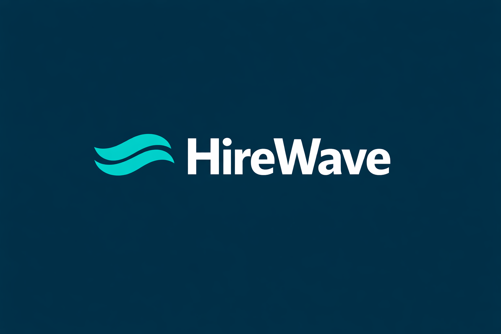
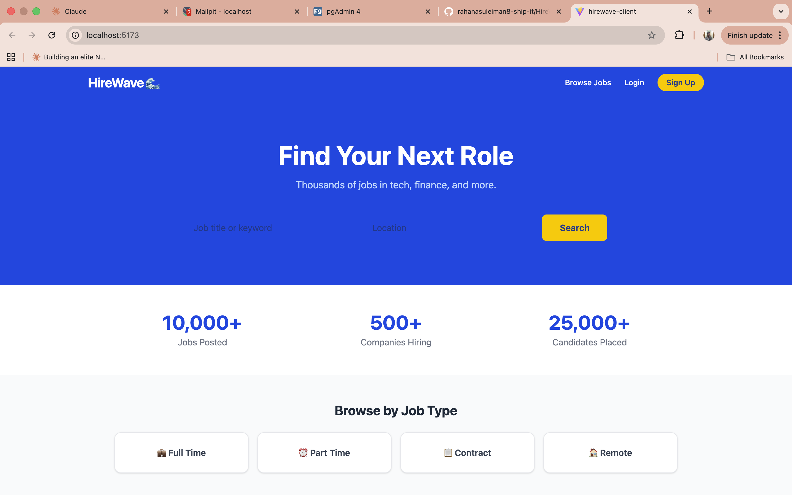
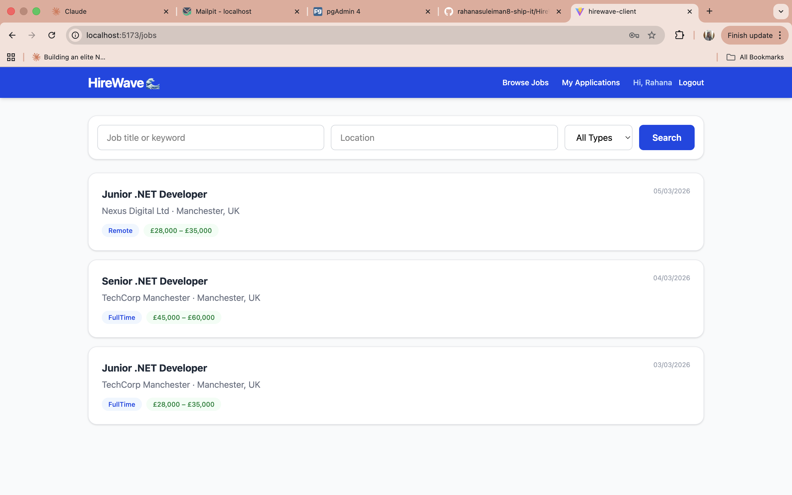
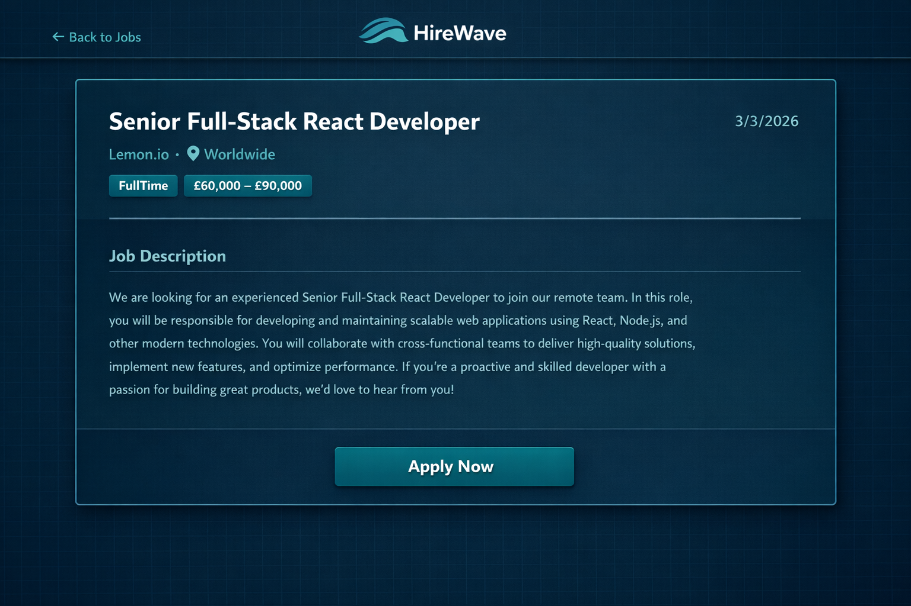
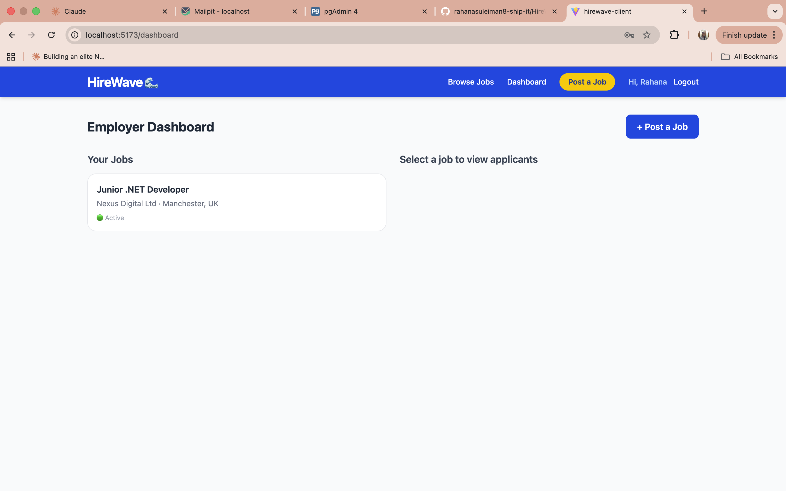

# 


A full-stack job board application built with **.NET 8 Web API** and **React**, inspired by Indeed. Employers can post jobs and manage applicants. Job seekers can browse, search, and apply — with email notifications at every step.

> Built as a portfolio project to demonstrate full-stack .NET development skills.

🌐 **Live Demo:** https://hire-wave-ten.vercel.app

---

## 📅 Project Timeline

| | |
|---|---|
| **Start Date** | October 2025 |
| **Completion Date** | February 2026 |
| **Duration** | ~4 months |
| **Status** | ✅ Complete & Deployed |

---

## Screenshots

### 🏠 Homepage


### 💼 Job Listings (with real-time jobs via Remotive API)


### 📄 Job Detail & Apply


### 📊 Employer Dashboard & Applicant Pipeline


---

## Tech Stack

**Backend**
- .NET 8 Web API
- ASP.NET Core Identity (role-based: Employer / Job Seeker)
- JWT Bearer Authentication
- Entity Framework Core 8
- PostgreSQL 16
- MailKit (email notifications via Mailpit in development)

**Frontend**
- React 18 (Vite)
- React Router v6
- Axios
- Tailwind CSS v4

**Infrastructure**
- Docker & Docker Compose (PostgreSQL + Mailpit)

---

## Features

- **Role-based auth** — separate flows for Employers and Job Seekers
- **JWT authentication** — secure, stateless API
- **Job listings** — employers can create, edit, and deactivate listings
- **Job search** — filter by keyword, location, job type, and salary
- **Pagination** — paginated job results
- **Applications** — job seekers can apply with a cover letter and optional CV upload
- **Email notifications** — confirmation emails on apply, and status update emails to applicants
- **Employer dashboard** — view all applicants per job, update application status (Applied → Reviewing → Interview → Offered → Rejected)

---

## Getting Started

### Prerequisites

- [.NET 8 SDK](https://dotnet.microsoft.com/download)
- [Node.js 18+](https://nodejs.org/)
- [Docker Desktop](https://www.docker.com/products/docker-desktop/)

### 1. Clone the repo
```bash
git clone https://github.com/rahanasuleiman8-ship-it/HireWave.git
cd HireWave
```

### 2. Start the database and mail server
```bash
docker compose up -d
```

This starts:
- **PostgreSQL 16** on port `5433`
- **Mailpit** (dev email catcher) on port `1025` (UI at `http://localhost:8025`)

### 3. Configure the API
```bash
cd src/HireWave.API
cp appsettings.example.json appsettings.json
# Edit appsettings.json with your settings
```

### 4. Run the API
```bash
dotnet run
# API runs at https://localhost:7001
```

### 5. Run the frontend
```bash
cd src/hirewave-client
npm install
npm run dev
# Frontend runs at http://localhost:5173
```

---

## Project Structure

```
HireWave/
├── src/
│   ├── HireWave.API/               # .NET 8 Web API
│   │   ├── Controllers/            # Auth, Jobs, Applications
│   │   ├── DTOs/                   # Request/Response models
│   │   ├── Data/                   # EF Core DbContext + Migrations
│   │   ├── Models/                 # Domain entities + enums
│   │   ├── Services/               # JwtService, EmailService
│   │   └── wwwroot/uploads/cvs/    # CV file storage
│   └── hirewave-client/            # React frontend (Vite)
│       └── src/
│           ├── api/                # Axios client
│           ├── context/            # Auth context
│           ├── pages/              # All page components
│           └── components/         # Navbar
└── docker-compose.yml
```

---

## API Endpoints

### Auth
| Method | Endpoint | Access |
|--------|----------|--------|
| POST | `/api/auth/register` | Public |
| POST | `/api/auth/login` | Public |

### Jobs
| Method | Endpoint | Access |
|--------|----------|--------|
| GET | `/api/jobs` | Public |
| GET | `/api/jobs/search` | Public |
| GET | `/api/jobs/{id}` | Public |
| GET | `/api/jobs/mine` | Employer |
| POST | `/api/jobs` | Employer |
| PUT | `/api/jobs/{id}` | Employer |
| DELETE | `/api/jobs/{id}` | Employer |

### Applications
| Method | Endpoint | Access |
|--------|----------|--------|
| POST | `/api/applications` | Job Seeker |
| GET | `/api/applications/mine` | Job Seeker |
| GET | `/api/applications/job/{jobId}` | Employer |
| PUT | `/api/applications/{id}/status` | Employer |

---

## Environment Variables

The API reads from `appsettings.json` (gitignored). Use `appsettings.example.json` as a template:
```json
{
  "ConnectionStrings": {
    "DefaultConnection": "Host=localhost;Port=5433;Database=hirewavedb;Username=hirewave;Password=yourpassword"
  },
  "JwtSettings": {
    "SecretKey": "your-secret-key-min-32-characters-long",
    "Issuer": "HireWave",
    "Audience": "HireWaveUsers",
    "ExpiryHours": 24
  },
  "EmailSettings": {
    "SmtpHost": "localhost",
    "SmtpPort": 1025,
    "FromEmail": "noreply@hirewave.com",
    "FromName": "HireWave"
  }
}
```

---

## Author

Built by **Rahana Suleiman** — aspiring .NET developer based in the UK.

- 🐙 GitHub: [@rahanasuleiman8-ship-it](https://github.com/rahanasuleiman8-ship-it)
- 💼 LinkedIn: [linkedin.com/in/rahana-suleiman-106b103b1](https://www.linkedin.com/in/rahana-suleiman-106b103b1/)

---

## Licence

MIT